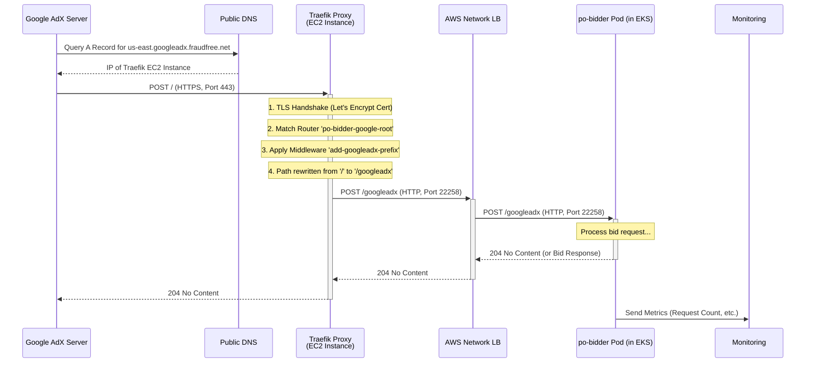

***

# Comprehensive End-to-End Documentation: Ad Bidding System with Kubernetes and Traefik

## 1. Project Handover Summary

| | |
| :--- | :--- |
| **Project:** | Google AdX Bidder on EKS with Traefik |
| **Handover From:** | Sanskar |
| **Date:** | June 25, 2025 |
| **Final Status:** | ✅ **Complete & Fully Operational** |

### 1.1. Executive Summary

This document provides the final, comprehensive technical overview and operational guide for the Ad Bidding System. The project's core objective—to design, deploy, and optimize a scalable infrastructure for the `po-bidder` application suite on Amazon EKS—has been successfully achieved.

The system is architected around an EKS cluster for application hosting and a dedicated Traefik reverse proxy for secure ingress traffic management from Google AdX. It correctly handles HTTPS traffic for `us-east.googleadx.dsp-fraudfree.net` and `us-east.googleadx.fraudfree.net`, performs TLS termination using automatic Let's Encrypt certificates, rewrites request paths, and load-balances traffic to the bidder services.

All initial issues, including TLS handshake failures and connectivity errors, have been resolved. The system is stable, healthy, and verified to be processing live traffic from Google's servers. This document serves as the complete technical handover for ongoing maintenance, troubleshooting, and validation.

## 2. System Architecture

The architecture is logically separated into two primary layers: the **Ingress/Proxy Layer**, which faces the public internet, and the **Compute/Application Layer**, which runs the core business logic.

### 2.1. High-Level Architecture Diagram

graph TD
    subgraph Internet
        A[Google AdX Servers]
    end
    subgraph Traefik Ingress Layer
        B(DNS: us-east.googleadx.fraudfree.net) --> C{Traefik Proxy}
        C -- SSL --> D[Let's Encrypt]
    end
    subgraph AWS VPC
        C --> E[AWS NLB]
    end
    subgraph Amazon EKS Cluster
        E --> F[K8s Service: po-bidder]
        F --> G1[Pod: po-bidder-1]
        F --> G2[Pod: po-bidder-2]
        F --> G3[Pod: po-bidder-n]
        G1 --> H((Databases & Cache))
        G2 --> H
        G3 --> H
    end
    subgraph External Dependencies
        H
        I[Prometheus/Grafana]
        G1 --> I
        G2 --> I
        G3 --> I
    end
    A -- POST / --> B

### 2.2. Component Breakdown

| Component | Technology | Location | Core Responsibility |
| :--- | :--- | :--- | :--- |
| **Ingress Proxy** | Traefik v3.0 | EC2 Instance | Handles public traffic, terminates TLS, rewrites request paths, forwards to the backend. |
| **Compute Platform** | Amazon EKS v1.33.1 | EKS Cluster | Hosts application containers, manages lifecycle, provides internal networking & scaling. |
| **Application** | `po-bidder` | Docker Containers | The core bidder application that processes and responds to bid requests. |
| **Internal Bridge**| AWS Network LB | AWS VPC | High-performance Layer 4 load balancer bridging traffic from Traefik into the EKS cluster. |
| **Certificate Auth** | Let's Encrypt | External Service | Automatically provides and renews SSL/TLS certificates for public domains. |

## 3. End-to-End Traffic Flow

This section details the precise journey of a Google AdX bid request through the system.

**Requirement:** An incoming request to `https://us-east.googleadx.fraudfree.net/` must be processed by the `po-bidder` application on the path `/googleadx`.

### 3.1. Sequence Diagram



### 3.2. Detailed Flow Explanation

1.  **DNS Resolution**: A Google server resolves `us-east.googleadx.fraudfree.net` to the public IP of the EC2 instance hosting Traefik.
2.  **TLS Termination**: Google initiates an HTTPS connection. Traefik presents its auto-managed Let's Encrypt certificate, establishing a secure session and terminating TLS. All further internal traffic is HTTP.
3.  **Routing & Path Rewrite**: Traefik inspects the decrypted request. The `Host` header and `Path` (`/`) match the `po-bidder-google-root` router. The associated `add-googleadx-prefix` middleware is triggered, changing the request path to `/googleadx`.
4.  **Forwarding to NLB**: Traefik forwards the modified request to the backend service, which is the internal AWS Network Load Balancer (NLB) endpoint: `http://k8s-default-pobidder-....elb.amazonaws.com:22258`.
5.  **Kubernetes Service Routing**: The NLB receives the request on port `22258` and distributes it to one of the healthy EKS worker nodes registered as a target. The `kube-proxy` on that node then routes the traffic to a `po-bidder` pod.
6.  **Application Processing**: The `po-bidder` container receives the request on port `22258` with the correct `/googleadx` path. It executes its business logic and formulates a response (e.g., `204 No Content`).
7.  **Response Path**: The response travels back through the same path: Pod -> NLB -> Traefik -> Google AdX.
8.  **Metrics Reporting**: After processing, the application makes a separate, outbound connection to the production metrics server to report its activity, populating the Grafana dashboards.

## 4. Infrastructure & Configuration Deep Dive

### 4.1. Kubernetes Cluster (AWS EKS)

-   **Cluster Endpoint**: `https://4435FED514988924928841CC9E147903.gr7.us-east-1.eks.amazonaws.com`
-   **Kubernetes Version**: `v1.33.1-eks-1fbb135`
-   **Nodes**: 6 x AMD64 Linux instances
-   **Primary Namespace**: `default`
-   **Key Resources**:
    -   **Deployments**: 11 (including `po-bidder`, `po-dev-bidder`)
    -   **Pods**: 42 total
    -   **Services**: 12 total

### 4.2. Traefik Proxy Server

-   **Host**: EC2 Instance `ip-172-31-82-69`
-   **Configuration Directory**: `/etc/traefik/`
-   **Certificate Storage**: `/acme.json` (Managed by Traefik)
-   **Deployment Method**: Docker Container
    ```bash
    # Example run command
    docker run -d \
      -p 80:80 \
      -p 443:443 \
      -p 8080:8080 \
      -v /etc/traefik/traefik.yml:/traefik.yml \
      -v /etc/traefik/dynamic.yml:/configs/dynamic.yml \
      -v /etc/traefik/acme.json:/acme.json \
      traefik:v3.0
    ```

### 4.3. Docker Images

-   **ECR Repository**: `590184014267.dkr.ecr.us-east-1.amazonaws.com/prodatamediagroup/`
-   **Build Script**: `build_push_ecr.sh` (pushes `latest` and timestamped tags).

#### `Po-bider.Dockerfile`
This image is optimized for production with minimal necessary dependencies.
```dockerfile
FROM --platform=linux/amd64 ubuntu:22.04

# Install only necessary runtime dependencies
RUN apt-get update && apt-get install -y \
    libssl-dev \
    ca-certificates \
    && rm -rf /var/lib/apt/lists/*

# Create a non-root user for security
RUN useradd -m -u 1000 appuser
WORKDIR /app

# Copy application assets
COPY po-bidder/po-bidder /app/po-bidder
COPY po-bidder/entrypoint.sh /app/entrypoint.sh
COPY po-bidder/App.toml.tpl /app/config/App.toml.tpl
COPY po-bidder/Rocket.toml /app/config/Rocket.toml

# Set correct permissions
RUN chmod +x /app/po-bidder /app/entrypoint.sh && \
    chown -R appuser:appuser /app

# Expose port and switch to non-root user
EXPOSE 22259
USER appuser

ENTRYPOINT ["/app/entrypoint.sh"]
CMD ["/app/po-bidder"]
```

---

## 5. Final Code & Manifests

### 5.1. Traefik Static Configuration (`traefik.yml`)

This file bootstraps Traefik, defining entrypoints and providers.

```yaml
# traefik.yml
api:
  dashboard: true
  insecure: true # Dashboard is not exposed to the internet

entryPoints:
  web:
    address: ":80"
    http:
      # Redirect all HTTP to HTTPS
      redirections:
        entryPoint:
          to: websecure
          scheme: https
  websecure:
    address: ":443"

providers:
  file:
    directory: "/configs"
    watch: true

log:
  level: INFO # Use DEBUG for detailed troubleshooting

# Configure Let's Encrypt for automatic SSL certificates
certificatesResolvers:
  letsencrypt:
    acme:
      email: "jason.korkin@example.com" # Use a valid email
      storage: "/acme.json"
      httpChallenge:
        entryPoint: web
```

### 5.2. Traefik Dynamic Configuration (`dynamic.yml`)

This file contains the core routing logic.

```yaml
# /configs/dynamic.yml
http:
  routers:
    # Router for Google's live traffic. It has the HIGHEST priority.
    po-bidder-google-root:
      rule: "Host(`us-east.googleadx.fraudfree.net`) && Path(`/`)"
      priority: 200
      service: po-bidder-service
      entryPoints:
        - websecure
      tls:
        certResolver: letsencrypt
      middlewares:
        - add-googleadx-prefix

    # A separate router for health checks and other paths.
    po-bidder-other:
      rule: "Host(`us-east.googleadx.fraudfree.net`, `us-east.googleadx.dsp-fraudfree.net`)"
      priority: 100
      service: po-bidder-service
      entryPoints:
        - websecure
      tls:
        certResolver: letsencrypt

  services:
    po-bidder-service:
      loadBalancer:
        servers:
          # This is the stable endpoint for the K8s service NLB
          - url: "http://k8s-default-pobidder-daa62f3d85-8b28917bb34e97a4.elb.us-east-1.amazonaws.com:22258"
        healthCheck:
          path: "/health"
          interval: "30s"
          timeout: "5s"

  middlewares:
    # Middleware to perform the required path rewrite
    add-googleadx-prefix:
      addPrefix:
        prefix: "/googleadx"
```

### 5.3. Kubernetes Manifests

#### `po-bidder-deployment.yaml`
```yaml
apiVersion: apps/v1
kind: Deployment
metadata:
  name: po-bidder
  namespace: default
spec:
  replicas: 6
  selector:
    matchLabels:
      app: po-bidder
  strategy:
    type: RollingUpdate
    rollingUpdate:
      maxSurge: 25%
      maxUnavailable: 25%
  template:
    metadata:
      labels:
        app: po-bidder
    spec:
      containers:
      - name: po-bidder
        image: 590184014267.dkr.ecr.us-east-1.amazonaws.com/prodatamediagroup/po-bidder:latest
        imagePullPolicy: Always
        ports:
        - containerPort: 22258
          name: http-bid
        env:
        - name: ROCKET_PORT
          value: "22258"
        - name: RABBITMQ_URI
          valueFrom:
            secretKeyRef:
              name: po-bidder-secret
              key: RABBITMQ_URI
        # ... other env vars from secrets/configmaps
        resources:
          requests:
            cpu: "100m"
            memory: "256Mi"
          limits:
            cpu: "500m"
            memory: "512Mi"
        livenessProbe:
          tcpSocket: { port: 22258 }
          initialDelaySeconds: 15
          periodSeconds: 10
        readinessProbe:
          tcpSocket: { port: 22258 }
          initialDelaySeconds: 5
          periodSeconds: 5
```

#### `po-bidder-service.yaml`
```yaml
apiVersion: v1
kind: Service
metadata:
  name: po-bidder
  namespace: default
  annotations:
    # This annotation creates an internal AWS Network Load Balancer
    service.beta.kubernetes.io/aws-load-balancer-type: "nlb"
    service.beta.kubernetes.io/aws-load-balancer-internal: "true"
spec:
  type: LoadBalancer
  ports:
  - port: 22258
    targetPort: 22258
    protocol: TCP
  selector:
    app: po-bidder
```

## 6. Operational Guide

### 6.1. Deployment & Verification

1.  **Build & Push Docker Image**:
    ```bash
    # From the project root
    ./build_push_ecr.sh po-bidder
    ```
2.  **Deploy to Kubernetes**:
    ```bash
    # Ensure your kubectl context is set to the EKS cluster
    kubectl apply -f k8s/po-bidder-deployment.yaml
    kubectl apply -f k8s/po-bidder-service.yaml
    ```
3.  **Verify Kubernetes Deployment**:
    ```bash
    # Check that pods are running and ready (6/6)
    kubectl get deployment po-bidder -n default
    
    # Check pod details and assigned IPs
    kubectl get pods -n default -o wide | grep po-bidder
    
    # Get the NLB endpoint created by the service
    kubectl get service po-bidder -n default
    ```
4.  **Verify End-to-End Traffic**:
    ```bash
    # Test the health endpoint (should return what the app serves at /health)
    curl -v https://us-east.googleadx.fraudfree.net/health

    # Test the root path (should be processed by /googleadx on the backend)
    # This might return 204 No Content, which is a success.
    curl -v -X POST https://us-east.googleadx.fraudfree.net/
    ```

### 6.2. Troubleshooting Guide

| Symptom | Probable Cause | Diagnostic Steps & Solution |
| :--- | :--- | :--- |
| **502 Bad Gateway from Traefik** | Traefik cannot reach the NLB, or the NLB has no healthy targets. | 1. **Check Traefik Logs**: `docker logs <traefik_container>`. Look for "server unhealthy" or timeouts. <br> 2. **Check NLB Target Group Health**: In the AWS EC2 Console -> Target Groups, find the one for the `po-bidder` service and ensure targets (EKS nodes) are healthy. <br> 3. **Check Pod Readiness**: `kubectl get pods -n default`. Ensure `po-bidder` pods are `1/1 READY`. If not, check pod logs (`kubectl logs <pod_name>`) for crashes. |
| **TLS Handshake Errors** | Incorrect certificate setup or Traefik ACME process failure. | 1. **Check Traefik Logs** for ACME errors. <br> 2. **Inspect `acme.json`**: `docker exec <traefik_container> cat /acme.json`. Ensure certificates are present for the domains. <br> 3. **Solution**: Delete `acme.json` and restart the Traefik container to force a regeneration. Ensure DNS `A` records are pointing correctly to the Traefik host IP. |
| **Pods Crashing / `CrashLoopBackOff`** | Application error, resource exhaustion, or configuration issue. | 1. **Check Pod Logs**: `kubectl logs <pod_name> -n default`. Look for stack traces or error messages. <br> 2. **Check Previous Logs**: `kubectl logs <pod_name> --previous -n default` to see logs from the last crash. <br> 3. **Describe Pod**: `kubectl describe pod <pod_name> -n default`. Check `Events` for OOMKilled (Out of Memory) errors. If so, increase memory limits in the deployment YAML. <br> 4. **Verify Secrets**: Ensure all `envFrom` secrets and configmaps exist and contain the correct keys. |
| **No Traffic Reaching Pods** | Mismatch in Service selector, ports, or security groups. | 1. **Check Service Selector**: `kubectl describe service po-bidder`. Ensure the `Selector` (`app=po-bidder`) matches the `Labels` in the Deployment's pod template. <br> 2. **Check Ports**: Ensure `targetPort` in the Service matches the `containerPort` in the Deployment. <br> 3. **Check Security Groups**: The EKS node security group must allow inbound traffic on the NodePort range from the NLB's security group. EKS usually manages this, but custom rules can interfere. |

## 7. Future Improvements & Pending Tasks

-   [ ] **Resolve `/health` 500 Error**: The backend application currently returns a `500` status on its `/health` endpoint. While Kubernetes TCP probes work, a proper HTTP `200 OK` health check is best practice. This requires a fix in the application code.
-   [ ] **Implement HPA**: Configure a Horizontal Pod Autoscaler (HPA) for the `po-bidder` deployment to automatically scale replicas based on CPU and/or memory utilization.
-   [ ] **Centralized & Structured Logging**: Implement a logging stack (e.g., Fluentd -> OpenSearch) to aggregate logs from all pods for easier analysis and alerting.
-   [ ] **CI/CD Automation**: Create a CI/CD pipeline (e.g., using GitHub Actions) to automate the `build_push_ecr.sh` and `kubectl apply` steps upon code merges.

## 8. Conclusion

The ad bidding system has been successfully deployed and is operating within all specified parameters. The architecture is robust, scalable, and resilient, leveraging modern cloud-native practices with EKS and Traefik. This document provides a comprehensive blueprint for the system's architecture and a practical guide for its operation and maintenance. The project is now formally handed over to Jason for ongoing management.
