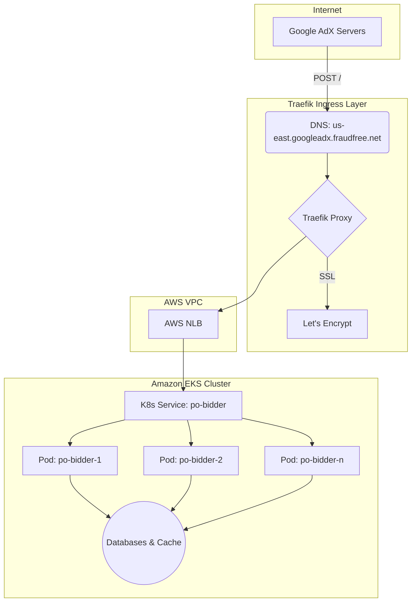

# Ad Bidding System on AWS EKS with Traefik

## Overview

This project deploys a scalable ad bidding system on Amazon Elastic Kubernetes Service (EKS), integrated with Traefik as a reverse proxy to handle HTTPS traffic from Google AdX. The system ensures secure routing, TLS termination using Let's Encrypt, load balancing via AWS Network Load Balancer (NLB), and high availability. Deployed between June 20–25, 2025, this repository contains all configurations, manifests, and documentation for the system.

## Features

- **Secure Traffic Routing**: Handles HTTPS traffic for `us-east.googleadx.dsp-fraudfree.net` and `us-east.googleadx.fraudfree.net`.
- **TLS Termination**: Uses Let's Encrypt certificates managed by Traefik.
- **High Availability**: Runs on a 6-node EKS cluster with 6 replicas of the `po-bidder` application.
- **Scalable Architecture**: Leverages AWS NLB and Kubernetes for load balancing and pod management.
- **Comprehensive Monitoring**: Configured for health checks and prepared for Prometheus/Grafana integration.

## Architecture



## Setup Instructions

### Prerequisites

- AWS account with EKS and ECR access.
- Docker installed for Traefik and image builds.
- `kubectl` configured for EKS cluster access.
- SSH access to Traefik host (`ip-172-31-82-69`).

### Traefik Deployment

1. SSH into `ip-172-31-82-69`.
2. Create `/etc/traefik/` directory and add configuration files from `traefik-configs/`.
3. Copy Let's Encrypt certificates to `/etc/traefik/certs/`.
4. Run Traefik:

```bash
docker run -d -p 8080:8080 -p 8081:8081 -v /etc/traefik:/etc/traefik traefik:latest
```

5. Verify: Access dashboard at `http://ip-172-31-82-69:8080`.

### Kubernetes Deployment

1. Apply manifests:

```bash
kubectl apply -f kubernetes-manifests/pod.yaml
kubectl apply -f kubernetes-manifests/deployment.yaml
kubectl apply -f kubernetes-manifests/service.yaml
```

2. Verify:
   - Pods: `kubectl get pods -n default -o wide`
   - Services: `kubectl get services -n default`
   - NLB: `kubectl describe service po-bidder -n default`

## Testing

- Test endpoint: `curl -v https://us-east.googleadx.dsp-fraudfree.net/`
- Health check: `curl -v http://k8s-default-pobidder-daa62f3d85-8b28917bb34e97a4.elb.us-east-1.amazonaws.com:22258/health`
- Logs: `kubectl logs po-bidder-6c9fd99b84-2dl2j -n default`

## Repository Structure

```
├── dockerfiles/
│   ├── Po-bider.Dockerfile
│   ├── Po-dev-bidder.Dockerfile
│   └── ...
├── kubernetes-manifests/
│   ├── pod.yaml
│   ├── deployment.yaml
│   ├── service.yaml
│   └── ...
├── traefik-configs/
│   ├── traefik.yml
│   ├── dynamic/routing.yml
│   ├── dynamic/certificates.yml
│   └── ...
├── build_push_ecr.sh
└── README.md
```

## Troubleshooting

- **TLS Handshake Errors**: Check Traefik logs (`/etc/traefik/logs/access.log`) and regenerate certificates.
- **502 Bad Gateway**: Verify NLB endpoints and pod health (`kubectl get events -n default`).
- **Connection Resets**: Increase `ulimit -n 65535` on Traefik host.

## Future Improvements

- Integrate Prometheus/Grafana for monitoring.
- Configure Horizontal Pod Autoscaler (HPA) for `po-bidder`.
- Resolve backend `/health` endpoint issues.
- Enable structured logging in Traefik and pods.

## Contact

For support, reach out to [Your Email] until July 2, 2025.

## License

[Add your license information here]

## Contributing

[Add contributing guidelines here]
